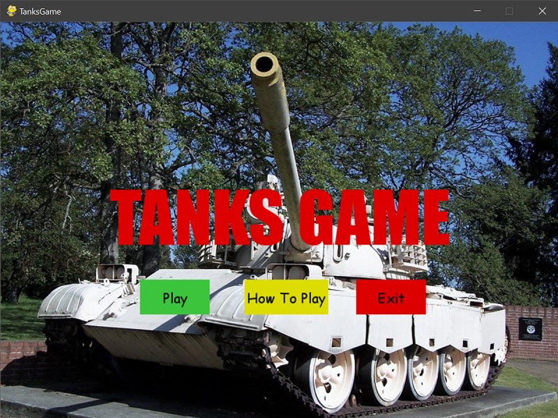
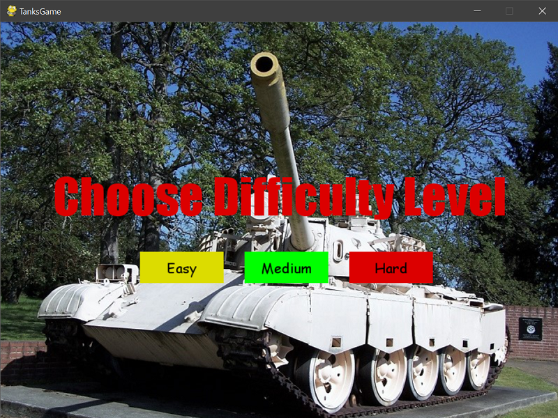
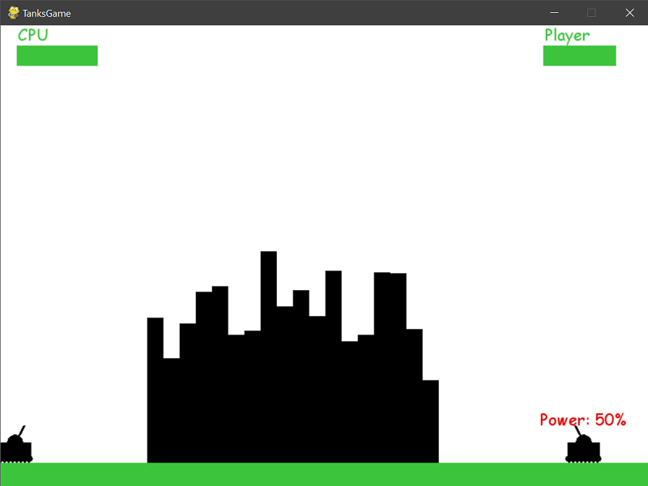
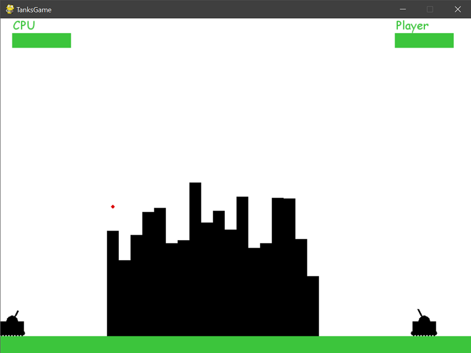
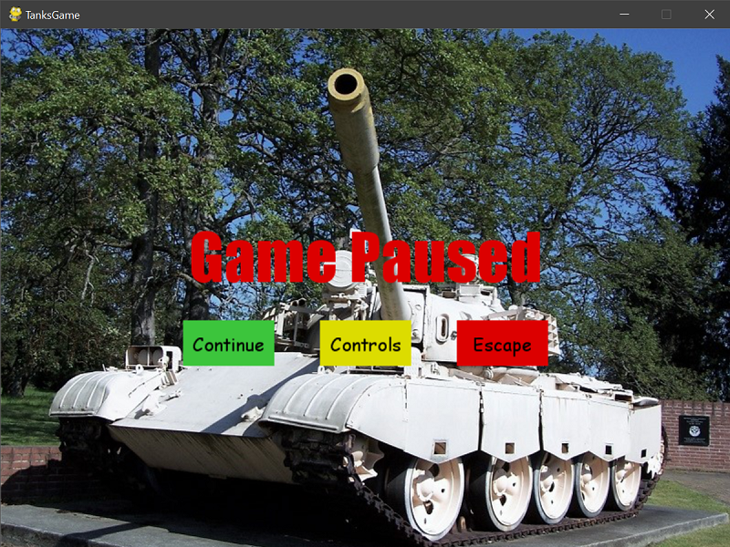
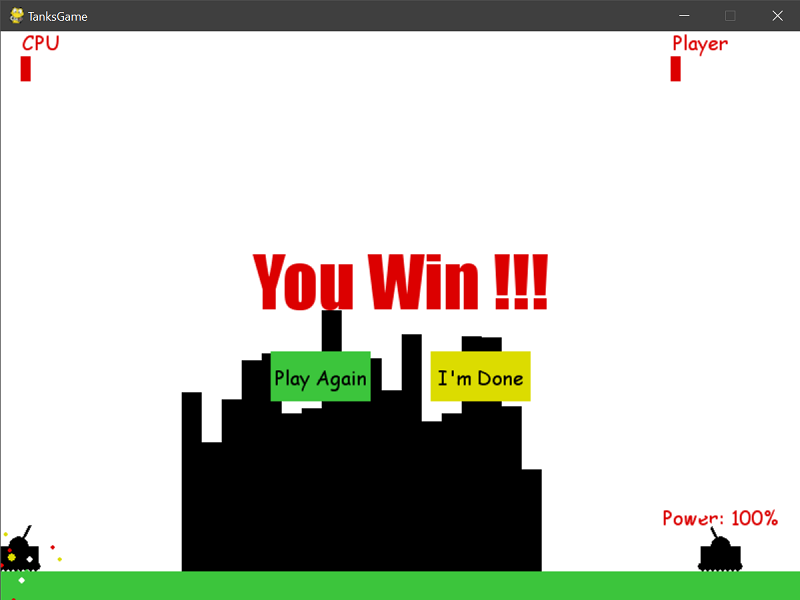

# TanksGame
**A Tank fight game made in pygame library of python**

1. The player is a tank which has to fight with opponent tank till one of them is knocked out! 
1. The opponent is CPU which will take the shot based on the level selected.
1. The tank can move left and right, change the turret positions and also the power of the shots.
1. The closer the shot, the more damage is incurred.

## Playing the Game
Download [TanksGame.zip](https://github.com/RashimNarayanTiku/TanksGame/blob/master/TanksGame.zip) and run *tanks.exe*.

&ensp;

# Images

## Game Intro

## Level Screen

## GamePlay

## Paused Screen

## Win Screen

&ensp; 

# Credits
* Intro music from [knarmahfox](https://freesound.org/people/knarmahfox/sounds/99699/)
* You Lose and You Win sounds from [EFlexMusic](https://freesound.org/people/EFlexMusic/sounds/418326/)
* Icon by [albabilham](https://www.iconfinder.com/albabilham)
